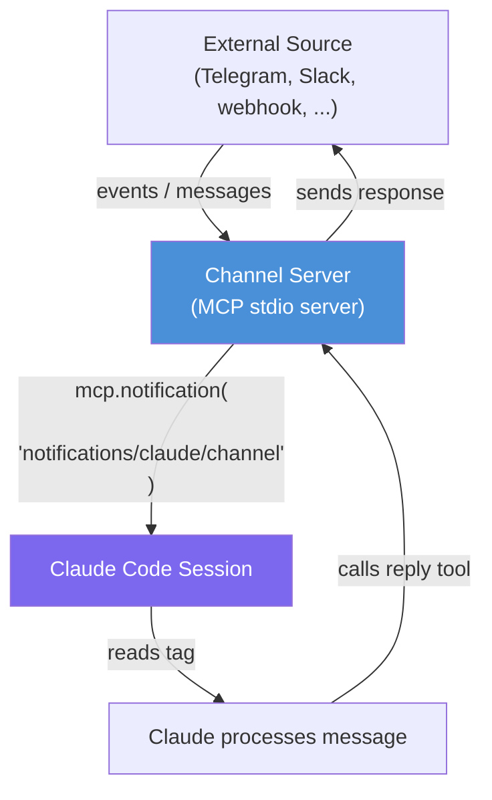
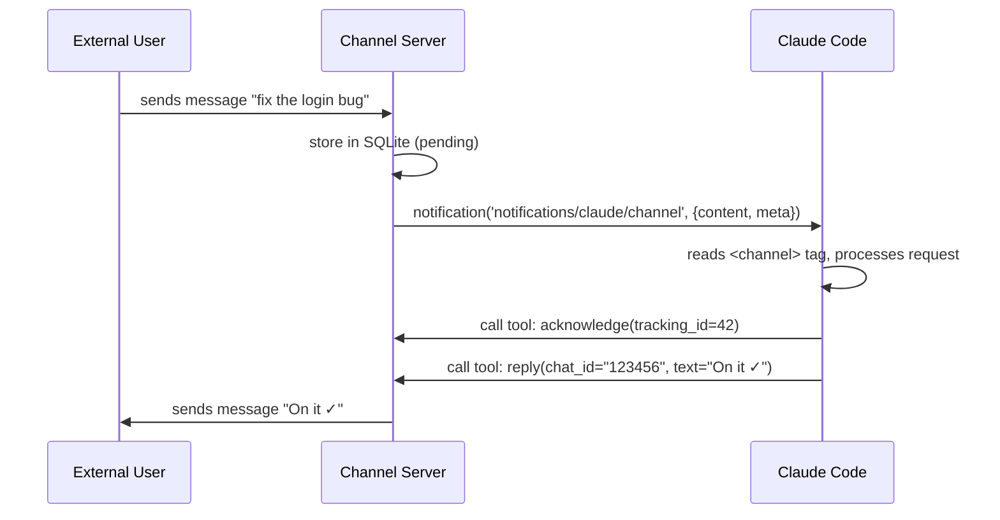

<picture>
  <source media="(prefers-color-scheme: dark)" srcset="../resources/logos/claude-howto-logo-dark.svg">
  
</picture>

# Claude Code Channel

> **Research preview** — requires Claude Code v2.1.80+, claude.ai login (Pro or higher).
> Console / API key auth is not supported. Team and Enterprise orgs must enable `channelsEnabled` in managed settings.

## Overview

A **Claude Code Channel** is a push-based messaging mechanism that lets external sources inject messages into a running Claude Code session in real time. Unlike standard MCP tools (which Claude calls on demand), a channel server can proactively push notifications to the session — turning Claude into a reactive agent that responds to outside events.

Channels are delivered over **MCP** (Model Context Protocol) using the `notifications/claude/channel` notification method. Messages arrive in the session as structured `<channel>` XML tags that Claude reads and acts upon.

Official documentation: [Channels reference](https://code.claude.com/docs/en/channels-reference) — [MCP overview](https://code.claude.com/docs/en/mcp)

**Key difference from regular MCP tools:**

| Regular MCP | Channel |
|-------------|---------|
| Claude calls tools when it wants data | External source pushes data to Claude |
| Pull-based | Push-based |
| Request/response | Event-driven |
| Tools exposed at server startup | Server streams notifications at any time |

**Two channel types:**

| Type | Use case |
|------|----------|
| One-way | Forward alerts, webhook events, CI results, monitoring — Claude reacts, no reply needed |
| Two-way | Chat bridge — server also exposes a `reply` tool so Claude can send messages back |

## Official Examples

### Webhook receiver (from Anthropic docs)

The simplest channel: listen on a local port, forward incoming HTTP requests to Claude.

```bash
mkdir webhook-channel && cd webhook-channel
bun add @modelcontextprotocol/sdk
```

```typescript
#!/usr/bin/env bun
import { Server } from '@modelcontextprotocol/sdk/server/index.js'
import { StdioServerTransport } from '@modelcontextprotocol/sdk/server/stdio.js'

const mcp = new Server(
  { name: 'webhook', version: '0.0.1' },
  {
    capabilities: { experimental: { 'claude/channel': {} } },
    instructions: 'Events from the webhook channel arrive as <channel source="webhook" ...>. They are one-way: read them and act, no reply expected.',
  },
)

await mcp.connect(new StdioServerTransport())

Bun.serve({
  port: 8788,
  hostname: '127.0.0.1',
  async fetch(req) {
    const body = await req.text()
    await mcp.notification({
      method: 'notifications/claude/channel',
      params: {
        content: body,
        meta: { path: new URL(req.url).pathname, method: req.method },
      },
    })
    return new Response('ok')
  },
})
```

Register in `.mcp.json`:

```json
{
  "mcpServers": {
    "webhook": { "command": "bun", "args": ["./webhook.ts"] }
  }
}
```

Test it:

```bash
# Start Claude Code with the channel
claude --dangerously-load-development-channels server:webhook

# In another terminal, push an event
curl -X POST localhost:8788 -d "build failed on main: https://ci.example.com/run/1234"
```

Claude receives:

```xml
<channel source="webhook" path="/" method="POST">
build failed on main: https://ci.example.com/run/1234
</channel>
```

### Working channel implementations

Anthropic's official plugin repository includes working reference implementations:
[anthropics/claude-plugins-official — external_plugins](https://github.com/anthropics/claude-plugins-official/tree/main/external_plugins)

### Open-source projects using channels

| Project | What it does |
|---------|--------------|
| [livetap/livetap](https://github.com/livetap/livetap) | Pushes live data streams (MQTT, WebSocket, file tailing) into Claude Code |
| [hookdeck.com guide](https://hookdeck.com/webhooks/platforms/claude-code-channels-webhooks-hookdeck) | Bridges localhost channel servers to the public internet via Hookdeck CLI |

## Architecture



## How It Works

### 1. Channel Server — the bridge

The channel server is a standard **MCP stdio server** with one extra capability declared:

```json
{
  "capabilities": {
    "tools": {},
    "experimental": {
      "claude/channel": {}
    }
  }
}
```

Declaring `claude/channel` in `experimental` capabilities tells Claude Code that this server is a channel — it may push unsolicited notifications at any time.

### 2. Pushing a message

When an external event arrives (e.g., a Telegram message), the server calls:

```typescript
await mcp.notification({
  method: "notifications/claude/channel",
  params: {
    content: "Hello Claude, what time is it?",
    meta: { chat_id: "123456", user: "alice", tracking_id: "42" },
  },
});
```

The `meta` object is optional. Each key-value pair becomes an attribute on the `<channel>` tag. Key names must contain only letters, digits, and underscores — hyphens are silently dropped.

Claude Code receives this notification and appends the `<channel>` tag content to the active conversation turn:

```xml
<channel source="my-channel" chat_id="123456" user="alice" tracking_id="42">
Hello Claude, what time is it?
</channel>
```

### 3. The `<channel>` tag format

Messages arrive as XML tags. The `source` attribute is always set to the MCP server name. All other attributes come from `meta`:

| Attribute | Description |
|-----------|-------------|
| `source` | MCP server name (set automatically by Claude Code) |
| Everything else | Your `meta` key-value pairs |

Common convention for chat bridges:

```xml
<channel
  source="bridge"
  chat_id="123456789"
  user="alice"
  tracking_id="42"
  ts="1712345678"
>
  Message text here
</channel>
```

### 4. Message flow in detail



## Setting Up a Channel Server

### Step 1: Implement the MCP server

A minimal two-way channel server in TypeScript:

```typescript
import { Server } from "@modelcontextprotocol/sdk/server/index.js";
import { StdioServerTransport } from "@modelcontextprotocol/sdk/server/stdio.js";
import { ListToolsRequestSchema, CallToolRequestSchema } from "@modelcontextprotocol/sdk/types.js";

const mcp = new Server(
  { name: "my-channel", version: "1.0.0" },
  {
    capabilities: {
      tools: {},
      experimental: { "claude/channel": {} },  // Required: declares this as a channel
    },
    instructions: [
      'Messages arrive as <channel source="my-channel" chat_id="..." user="..."> tags.',
      "After processing each message, call acknowledge(tracking_id).",
      "Reply with the reply tool — pass chat_id back.",
    ].join("\n"),
  }
);

mcp.setRequestHandler(ListToolsRequestSchema, async () => ({
  tools: [
    {
      name: "reply",
      description: "Send a reply back to the external source",
      inputSchema: {
        type: "object" as const,
        properties: {
          chat_id: { type: "string" },
          text: { type: "string" },
        },
        required: ["chat_id", "text"],
      },
    },
    {
      name: "acknowledge",
      description: "Acknowledge that a message was processed",
      inputSchema: {
        type: "object" as const,
        properties: {
          tracking_id: { type: "number" },
        },
        required: ["tracking_id"],
      },
    },
  ],
}));

mcp.setRequestHandler(CallToolRequestSchema, async (req) => {
  if (req.params.name === "reply") {
    const { chat_id, text } = req.params.arguments as any;
    // TODO: send text to external source via chat_id
    return { content: [{ type: "text", text: `Sent: ${text}` }] };
  }
  if (req.params.name === "acknowledge") {
    return { content: [{ type: "text", text: "Acknowledged" }] };
  }
  throw new Error(`Unknown tool: ${req.params.name}`);
});

function pushToSession(chatId: string, user: string, text: string, trackingId: number) {
  mcp.notification({
    method: "notifications/claude/channel",
    params: {
      content: text,
      meta: { chat_id: chatId, user, tracking_id: String(trackingId) },
    },
  });
}

const transport = new StdioServerTransport();
await mcp.connect(transport);
```

### Step 2: Configure `.mcp.json`

```json
{
  "mcpServers": {
    "my-channel": {
      "type": "stdio",
      "command": "bun",
      "args": ["run", "/path/to/channel/server.ts"],
      "env": {
        "MY_API_TOKEN": "your-token-here"
      }
    }
  }
}
```

### Step 3: Start Claude Code with channel support

```bash
# Development (bypasses allowlist check)
claude --dangerously-load-development-channels server:my-channel

# With permissions bypassed for unattended use
claude --dangerously-load-development-channels server:my-channel --dangerously-skip-permissions
```

The `--dangerously-load-development-channels` flag is required during the research preview for custom channels. In production (once published to an approved marketplace), channels load automatically.

## Permission Relay (v2.1.81+)

A two-way channel can optionally relay Claude's tool-approval prompts to a remote user, letting them approve or deny from their chat app. Both the terminal and the remote user can answer — first response wins.

Covers: `Bash`, `Write`, `Edit` approvals. Does NOT relay project trust dialogs or MCP server consent.

**Declare the extra capability:**

```typescript
capabilities: {
  experimental: {
    "claude/channel": {},
    "claude/channel/permission": {},  // enables permission relay
  },
  tools: {},
},
```

**Handle the incoming request:**

```typescript
import { z } from "zod";

const PermissionRequestSchema = z.object({
  method: z.literal("notifications/claude/channel/permission_request"),
  params: z.object({
    request_id: z.string(),   // 5 lowercase letters (no 'l'), e.g. "abcde"
    tool_name: z.string(),
    description: z.string(),
    input_preview: z.string(),
  }),
});

mcp.setNotificationHandler(PermissionRequestSchema, async ({ params }) => {
  sendToChatApp(
    `Claude wants to run ${params.tool_name}: ${params.description}\n\n` +
    `Reply "yes ${params.request_id}" or "no ${params.request_id}"`
  );
});
```

**Parse the verdict from the remote user's reply:**

```typescript
// [a-km-z] is the request_id alphabet Claude Code uses (lowercase, no 'l')
const PERMISSION_REPLY_RE = /^\s*(y|yes|n|no)\s+([a-km-z]{5})\s*$/i;

async function onInbound(message: PlatformMessage) {
  if (!allowedSenders.has(message.from.id)) return;  // gate on sender, not room

  const m = PERMISSION_REPLY_RE.exec(message.text);
  if (m) {
    await mcp.notification({
      method: "notifications/claude/channel/permission",
      params: {
        request_id: m[2].toLowerCase(),
        behavior: m[1].toLowerCase().startsWith("y") ? "allow" : "deny",
      },
    });
    return;
  }

  // Regular message — forward to Claude
  await mcp.notification({
    method: "notifications/claude/channel",
    params: {
      content: message.text,
      meta: { chat_id: String(message.chat.id) },
    },
  });
}
```

## Handling Notification Timing

A critical detail: **do not send a notification while a tool response is in flight**. Interleaving a notification with a pending tool response corrupts the MCP protocol stream.

The pattern to avoid this:

```typescript
let toolCallInFlight = false;
const pendingNotifications: Array<{ method: string; params: any }> = [];

function queuedNotification(msg: { method: string; params: any }) {
  if (toolCallInFlight) {
    pendingNotifications.push(msg);  // defer
  } else {
    mcp.notification(msg);
  }
}

function flushPendingNotifications() {
  while (pendingNotifications.length > 0) {
    mcp.notification(pendingNotifications.shift()!);
  }
}
```

## Tips and Best Practices

**Gate on sender identity, not room**
Always validate the sender before pushing to the session. In group chats, `message.from.id` (sender) and `message.chat.id` (room) differ — gating on room lets anyone in an allowlisted group inject messages.

```typescript
const ALLOWED_USER_IDS = new Set(["123456789", "987654321"]);

bot.on("message", (ctx) => {
  if (!ALLOWED_USER_IDS.has(String(ctx.from?.id))) {
    ctx.reply("Unauthorized.");
    return;
  }
  pushToSession(...);
});
```

**Acknowledgement and retry**
Always implement an acknowledgement mechanism. If Claude does not acknowledge a message within a timeout (e.g., 30 seconds), retry the push. This handles cases where Claude was busy processing another message.

```typescript
const RETRY_TIMEOUT_MS = 30_000;
const MAX_RETRIES = 5;
```

**Safety-net polling**
Push notifications can be missed if Claude is in the middle of a long tool call. Expose a `check_messages` tool that Claude calls after each response to catch any messages missed by push.

**Keep replies short**
If your channel is a mobile app (Telegram, WhatsApp), instruct Claude to keep replies concise via the server's `instructions` field — mobile screens are small.

**Log to stderr, not stdout**
stdout is reserved for MCP protocol communication. Use `console.error` for all logging.

**One channel per project directory**
`.mcp.json` is project-scoped. Each Claude Code project directory can have its own channel server with different environment variables (different bot tokens, different databases).

**Use `instructions` in the server capabilities**
Pass channel-specific instructions via the MCP server's `capabilities.instructions` string. They are added to Claude's system prompt and work even when users have not customized their `CLAUDE.md`.

## Real-World Example: claude-bridge

[claude-bridge](https://github.com/hieutrtr/claude-bridge) is a complete implementation using Claude Code Channels to turn Claude into a Telegram-controlled AI agent platform. It demonstrates the full pattern: channel server (grammy + SQLite), acknowledgement with retry, sub-agent dispatch via `bridge_dispatch`, and completion notifications via stop hooks.

## Known Issues

Several open issues on [anthropics/claude-code](https://github.com/anthropics/claude-code) (e.g., #36802, #40729) report that `notifications/claude/channel` events are emitted correctly but do not reach the Claude Code session in some versions. This appears to be a client-side notification routing bug introduced around Claude Code v2.1.81+. If notifications are not arriving, check the issue tracker for the current status.

## Related Topics

- [MCP Servers](../05-mcp/) — General MCP server setup and tool registration
- [Hooks](../06-hooks/) — Event-driven automation within Claude sessions
- [Subagents](../04-subagents/) — Spawning specialized agents from within a session
- [CLI Reference](../10-cli/) — `--dangerously-load-development-channels` and related flags
