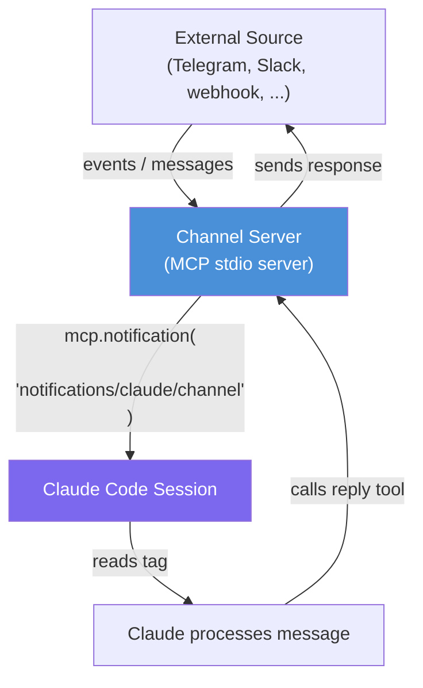
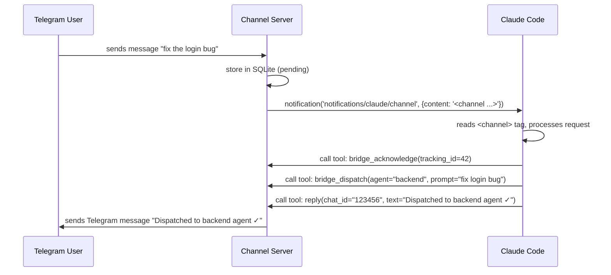

<picture>
  <source media="(prefers-color-scheme: dark)" srcset="../resources/logos/claude-howto-logo-dark.svg">
  
</picture>

# Claude Code Channel

## Overview

A **Claude Code Channel** is a push-based messaging mechanism that lets external sources inject messages into a running Claude Code session in real time. Unlike standard MCP tools (which Claude calls on demand), a channel server can proactively push notifications to the session — turning Claude into a reactive agent that responds to outside events.

Channels are delivered over **MCP** (Model Context Protocol) using the `notifications/claude/channel` notification method. Messages arrive in the session as structured `<channel>` XML tags that Claude reads and acts upon.

**Key difference from regular MCP tools:**

| Regular MCP | Channel |
|-------------|---------|
| Claude calls tools when it wants data | External source pushes data to Claude |
| Pull-based | Push-based |
| Request/response | Event-driven |
| Tools exposed at server startup | Server streams notifications at any time |

## Architecture



## How It Works

### 1. Channel Server — the bridge

The channel server is a standard **MCP stdio server** with one extra capability declared:

```json
{
  "capabilities": {
    "tools": {},
    "experimental": {
      "claude/channel": {}
    }
  }
}
```

Declaring `claude/channel` in `experimental` capabilities tells Claude Code that this server is a channel — it may push unsolicited notifications at any time.

### 2. Pushing a message

When an external event arrives (e.g., a Telegram message), the server calls:

```typescript
mcp.notification({
  method: "notifications/claude/channel",
  params: {
    content: '<channel source="telegram" chat_id="123456" user="alice" tracking_id="42" ts="1712345678">Hello Claude, what time is it?</channel>',
  },
});
```

Claude Code receives this notification and appends the `<channel>` tag content to the active conversation turn.

### 3. Message flow in detail



### 4. The `<channel>` tag format

Messages arrive as XML tags with metadata attributes:

```xml
<channel
  source="bridge"
  chat_id="123456789"
  user="alice"
  tracking_id="42"
  ts="1712345678"
  image_path="/tmp/photo.jpg"
  attachment_file_id="BQACAgI..."
>
  Message text here
</channel>
```

| Attribute | Description |
|-----------|-------------|
| `source` | Which integration sent this (e.g., `bridge`, `telegram`, `task_completion`) |
| `chat_id` | Channel-specific identifier to route the reply back |
| `user` | Display name or username of the sender |
| `tracking_id` | Unique ID for acknowledgement (prevents duplicate processing) |
| `ts` | Unix timestamp of the original message |
| `image_path` | Local file path if sender attached a photo |
| `attachment_file_id` | File ID to download a non-photo attachment |

## Setting Up a Channel Server

### Step 1: Implement the MCP server

A minimal channel server in TypeScript (using `@modelcontextprotocol/sdk`):

```typescript
import { Server } from "@modelcontextprotocol/sdk/server/index.js";
import { StdioServerTransport } from "@modelcontextprotocol/sdk/server/stdio.js";
import { ListToolsRequestSchema, CallToolRequestSchema } from "@modelcontextprotocol/sdk/types.js";

const mcp = new Server(
  { name: "my-channel", version: "1.0.0" },
  {
    capabilities: {
      tools: {},
      experimental: { "claude/channel": {} },  // Required: declares this as a channel
    },
    instructions: [
      'Messages arrive as <channel source="my-channel" chat_id="..." user="..."> tags.',
      "After processing each message, call acknowledge(tracking_id).",
      "Reply with the reply tool — pass chat_id back.",
    ].join("\n"),
  }
);

// Register tools for Claude to call
mcp.setRequestHandler(ListToolsRequestSchema, async () => ({
  tools: [
    {
      name: "reply",
      description: "Send a reply back to the external source",
      inputSchema: {
        type: "object" as const,
        properties: {
          chat_id: { type: "string" },
          text: { type: "string" },
        },
        required: ["chat_id", "text"],
      },
    },
    {
      name: "acknowledge",
      description: "Acknowledge that a message was processed",
      inputSchema: {
        type: "object" as const,
        properties: {
          tracking_id: { type: "number" },
        },
        required: ["tracking_id"],
      },
    },
  ],
}));

// Handle tool calls from Claude
mcp.setRequestHandler(CallToolRequestSchema, async (req) => {
  if (req.params.name === "reply") {
    const { chat_id, text } = req.params.arguments as any;
    // TODO: send text to external source via chat_id
    return { content: [{ type: "text", text: `Sent: ${text}` }] };
  }
  if (req.params.name === "acknowledge") {
    // Mark message as processed in your database
    return { content: [{ type: "text", text: "Acknowledged" }] };
  }
  throw new Error(`Unknown tool: ${req.params.name}`);
});

// Push a message from external source into Claude
function pushToSession(chatId: string, user: string, text: string, trackingId: number) {
  mcp.notification({
    method: "notifications/claude/channel",
    params: {
      content: `<channel source="my-channel" chat_id="${chatId}" user="${user}" tracking_id="${trackingId}">${text}</channel>`,
    },
  });
}

// Start the stdio transport
const transport = new StdioServerTransport();
await mcp.connect(transport);
```

### Step 2: Configure `.mcp.json`

Register the channel server in `.mcp.json` at the root of your Claude Code project directory:

```json
{
  "mcpServers": {
    "my-channel": {
      "type": "stdio",
      "command": "bun",
      "args": ["run", "/path/to/channel/server.ts"],
      "env": {
        "MY_API_TOKEN": "your-token-here"
      }
    }
  }
}
```

### Step 3: Start Claude Code with channel support

```bash
claude --dangerously-load-development-channels server:my-channel --dangerously-skip-permissions
```

The `--dangerously-load-development-channels` flag is required during development. In production, channels registered in `.mcp.json` load automatically.

## Real-World Example: Telegram Integration (claude-bridge)

[claude-bridge](https://github.com/hieutrtr/claude-bridge) is a complete implementation that uses Claude Code Channels to turn Claude into a Telegram-controlled AI agent platform.

### What it does

```
You (Telegram phone)
  │
  ▼
Channel Server (grammy + SQLite)   Polls Telegram via long-polling
  │ mcp.notification (push)         Retries if not ack'd in 30s
  ▼
Claude Code "Bridge Bot" session   <channel> tags drive the conversation
  │ bridge_dispatch(agent, prompt)
  ▼
claude --agent --worktree -p "..."  Isolated Claude Code sub-agent per task
  │
  ▼
Stop hook → completion script      Queues notification back to Telegram
```

### The generated `.mcp.json`

```json
{
  "mcpServers": {
    "bridge": {
      "type": "stdio",
      "command": "bun",
      "args": ["run", "~/.claude-bridge/channel/dist/server.js"],
      "env": {
        "TELEGRAM_BOT_TOKEN": "7123456789:AAF...",
        "MESSAGES_DB_PATH": "~/.claude-bridge/messages.db",
        "CLAUDE_BRIDGE_HOME": "~/.claude-bridge"
      }
    }
  }
}
```

### Tools exposed to Claude

| Tool | Purpose |
|------|---------|
| `reply` | Send a Telegram message back to a `chat_id` |
| `bridge_acknowledge` | Mark a channel message as processed (prevents retry) |
| `bridge_dispatch` | Spawn a sub-agent to handle a task in an isolated worktree |
| `bridge_status` | Check running tasks |
| `bridge_agents` | List available agents |
| `bridge_get_notifications` | Poll for completed task notifications |
| `bridge_check_messages` | Safety-net poll for missed messages |
| `download_attachment` | Download a file attachment sent via Telegram |

### CLAUDE.md instructions for the bridge bot session

The server passes instructions directly via `capabilities.instructions` — no manual CLAUDE.md editing needed:

```
Messages from Telegram arrive as <channel source="bridge" chat_id="..." user="..." tracking_id="..." ts="...">.
If the tag has an image_path attribute, Read that file — it is a photo the sender attached.
After processing each message: call bridge_acknowledge(tracking_id), then bridge_get_notifications(), then bridge_check_messages().
Reply with the reply tool — pass chat_id back. Keep replies concise (users are on mobile).
Use bridge_dispatch to send tasks to agents. Use bridge_status to check running tasks.
```

### A session in action

```
[Telegram user "alice"]:  dispatch backend fix the login bug

Claude receives:
  <channel source="bridge" chat_id="123456" user="alice" tracking_id="7" ts="1712345600">
    dispatch backend fix the login bug
  </channel>

Claude:
  1. Parses intent → "dispatch task to agent named 'backend'"
  2. Calls bridge_dispatch(agent="backend", prompt="fix the login bug", chat_id="123456")
  3. Calls bridge_acknowledge(tracking_id=7)
  4. Calls reply(chat_id="123456", text="Dispatched to backend ✓ I'll notify you when done.")

[Telegram user "alice" receives]:  Dispatched to backend ✓ I'll notify you when done.
```

## Handling Notification Timing

A critical detail: **do not send a notification while a tool response is in flight**. Interleaving a notification with a pending tool response corrupts the MCP protocol stream.

The pattern to avoid this:

```typescript
let toolCallInFlight = false;
const pendingNotifications: Array<{ method: string; params: any }> = [];

function queuedNotification(msg: { method: string; params: any }) {
  if (toolCallInFlight) {
    pendingNotifications.push(msg);  // defer
  } else {
    mcp.notification(msg);
  }
}

// After returning a tool response:
function flushPendingNotifications() {
  while (pendingNotifications.length > 0) {
    mcp.notification(pendingNotifications.shift()!);
  }
}
```

## Tips and Best Practices

**Acknowledgement and retry**
Always implement an acknowledgement mechanism. If Claude does not acknowledge a message within a timeout (e.g., 30 seconds), retry the push. This handles cases where Claude was busy processing another message.

```typescript
const RETRY_TIMEOUT_MS = 30_000;
const MAX_RETRIES = 5;
```

**Safety-net polling**
Push notifications can be missed if Claude is in the middle of a long tool call. Expose a `check_messages` tool that Claude calls after each response to catch any messages missed by push.

**Keep replies short**
If your channel is a mobile app (Telegram, WhatsApp), instruct Claude to keep replies concise via the server's `instructions` field — mobile screens are small.

**User allowlist for security**
Validate the sender identity before pushing to the session. A malicious actor with your bot token endpoint could inject arbitrary instructions into Claude.

```typescript
const ALLOWED_USER_IDS = new Set(["123456789", "987654321"]);

bot.on("message", (ctx) => {
  if (!ALLOWED_USER_IDS.has(String(ctx.from?.id))) {
    ctx.reply("Unauthorized.");
    return;
  }
  pushToSession(...);
});
```

**One channel per project directory**
`.mcp.json` is project-scoped. Each Claude Code project directory can have its own channel server with different environment variables (different bot tokens, different databases).

**Use `instructions` in the server capabilities**
Instead of writing channel-specific instructions in `CLAUDE.md`, pass them via the MCP server's `capabilities.instructions` string. This keeps the instructions co-located with the server code and works even when users have not customized their `CLAUDE.md`.

## Related Topics

- [MCP Servers](../05-mcp/) — General MCP server setup and tool registration
- [Hooks](../06-hooks/) — Event-driven automation within Claude sessions
- [Subagents](../04-subagents/) — Spawning specialized agents from within a session
- [CLI Reference](../10-cli/) — `--dangerously-load-development-channels` and related flags
