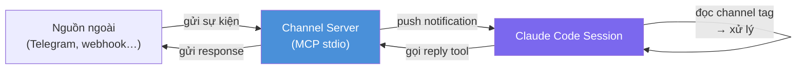
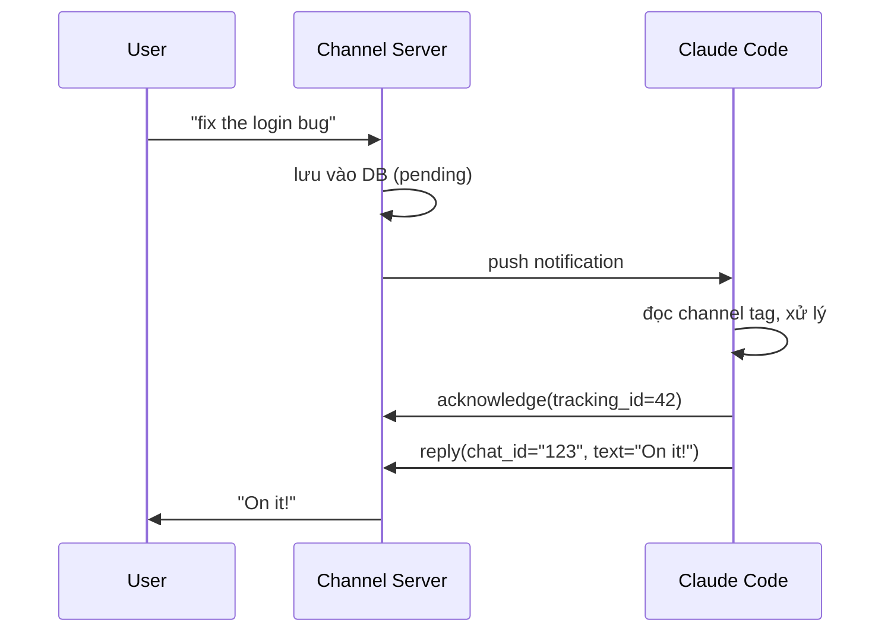

<picture>
  <source media="(prefers-color-scheme: dark)" srcset="../resources/logos/claude-howto-logo-dark.svg">
  
</picture>

# Claude Code Channels

> **Research preview** — requires Claude Code v2.1.80+, claude.ai login (Pro or higher).
> Console / API key auth is not supported. Team and Enterprise orgs must enable `channelsEnabled` in managed settings.

---

## Channel là gì?

Hãy tưởng tượng bạn đang làm việc với Claude — Claude chờ bạn gõ lệnh, rồi trả lời, rồi lại chờ. Đó là cách hoạt động thông thường: bạn hỏi, Claude đáp.

**Channel thay đổi điều đó.** Với channel, các nguồn bên ngoài (Telegram, Slack, webhook CI/CD…) có thể chủ động *gửi tin nhắn vào session của Claude* bất cứ lúc nào — giống như ai đó gõ cửa phòng bạn thay vì chờ bạn gọi điện trước.

**Ví dụ đời thường:**

```
Không có channel:    Bạn → hỏi Claude → Claude trả lời
Có channel:          CI server → báo build thất bại → Claude tự xử lý
                     Telegram user → nhắn tin → Claude phản hồi
                     Webhook → gửi alert → Claude điều tra
```

Về mặt kỹ thuật, channel là một **MCP server** đặc biệt có thêm khả năng *push notification* vào session, thay vì chỉ chờ Claude gọi tools.

---

## Pull vs Push — sự khác biệt then chốt

| | MCP thông thường | Channel |
|---|---|---|
| **Ai khởi xướng?** | Claude gọi tool khi cần | Server ngoài push vào Claude |
| **Kiểu** | Pull (kéo) | Push (đẩy) |
| **Dùng khi** | Claude cần tra cứu dữ liệu | Có sự kiện bên ngoài cần Claude xử lý |
| **Ví dụ** | `get_weather("Hanoi")` | `"Build failed on main branch"` |

---

## Hai loại channel

| Loại | Mô tả | Dùng khi |
|------|--------|----------|
| **One-way** | Chỉ nhận tin, không cần Claude reply | Forward alerts, CI results, monitoring |
| **Two-way** | Nhận tin + Claude có thể reply lại | Chat bridge (Telegram, Slack…) |

---

## Luồng hoạt động



**4 bước trong một lượt:**

1. Nguồn ngoài gửi event đến Channel Server
2. Channel Server gọi `mcp.notification('notifications/claude/channel', ...)`
3. Claude Code nhận được và thấy `<channel source="webhook">nội dung</channel>` trong conversation
4. Claude đọc, xử lý, và (nếu two-way) gọi tool `reply` để trả lời

---

## Bắt đầu nhanh — Webhook nhận event

Ví dụ đơn giản nhất: lắng nghe HTTP request và đẩy vào Claude.

### 1. Cài đặt

```bash
mkdir webhook-channel && cd webhook-channel
bun add @modelcontextprotocol/sdk
```

### 2. Tạo `webhook.ts`

```typescript
#!/usr/bin/env bun
import { Server } from '@modelcontextprotocol/sdk/server/index.js'
import { StdioServerTransport } from '@modelcontextprotocol/sdk/server/stdio.js'

const mcp = new Server(
  { name: 'webhook', version: '0.0.1' },
  {
    capabilities: {
      experimental: { 'claude/channel': {} },  // khai báo đây là channel
    },
    instructions: 'Events arrive as <channel source="webhook">. Read and act on them.',
  },
)

await mcp.connect(new StdioServerTransport())

// HTTP server nhận webhook
Bun.serve({
  port: 8788,
  hostname: '127.0.0.1',
  async fetch(req) {
    const body = await req.text()
    await mcp.notification({
      method: 'notifications/claude/channel',
      params: {
        content: body,
        meta: { path: new URL(req.url).pathname, method: req.method },
      },
    })
    return new Response('ok')
  },
})
```

### 3. Đăng ký trong `.mcp.json`

```json
{
  "mcpServers": {
    "webhook": { "command": "bun", "args": ["./webhook.ts"] }
  }
}
```

### 4. Chạy và test

```bash
# Terminal 1: khởi động Claude với channel
claude --dangerously-load-development-channels server:webhook

# Terminal 2: gửi event thử
curl -X POST localhost:8788 -d "build failed on main: https://ci.example.com/run/1234"
```

Claude sẽ nhận được:

```xml
<channel source="webhook" path="/" method="POST">
build failed on main: https://ci.example.com/run/1234
</channel>
```

> **Note:** Flag `--dangerously-load-development-channels` bắt buộc trong research preview. Sau khi publish lên marketplace thì channel tự load bình thường.

---

## Channel hai chiều — Claude reply lại

Khi cần Claude trả lời (chat bridge, Telegram bot…), thêm tool `reply` vào server.

```typescript
import { Server } from "@modelcontextprotocol/sdk/server/index.js";
import { StdioServerTransport } from "@modelcontextprotocol/sdk/server/stdio.js";
import { ListToolsRequestSchema, CallToolRequestSchema } from "@modelcontextprotocol/sdk/types.js";

const mcp = new Server(
  { name: "my-channel", version: "1.0.0" },
  {
    capabilities: {
      tools: {},
      experimental: { "claude/channel": {} },
    },
    instructions: [
      'Messages arrive as <channel source="my-channel" chat_id="..." user="...">.',
      "After processing, call acknowledge(tracking_id).",
      "Reply with the reply tool — pass chat_id back.",
    ].join("\n"),
  }
);

// Khai báo tools
mcp.setRequestHandler(ListToolsRequestSchema, async () => ({
  tools: [
    {
      name: "reply",
      description: "Send a reply back to the external source",
      inputSchema: {
        type: "object" as const,
        properties: {
          chat_id: { type: "string" },
          text: { type: "string" },
        },
        required: ["chat_id", "text"],
      },
    },
    {
      name: "acknowledge",
      description: "Acknowledge that a message was processed",
      inputSchema: {
        type: "object" as const,
        properties: {
          tracking_id: { type: "number" },
        },
        required: ["tracking_id"],
      },
    },
  ],
}));

// Xử lý khi Claude gọi tools
mcp.setRequestHandler(CallToolRequestSchema, async (req) => {
  if (req.params.name === "reply") {
    const { chat_id, text } = req.params.arguments as any;
    // TODO: gửi text về nguồn ngoài qua chat_id
    return { content: [{ type: "text", text: `Sent: ${text}` }] };
  }
  if (req.params.name === "acknowledge") {
    return { content: [{ type: "text", text: "Acknowledged" }] };
  }
  throw new Error(`Unknown tool: ${req.params.name}`);
});

// Push message vào Claude
function pushToSession(chatId: string, user: string, text: string, trackingId: number) {
  mcp.notification({
    method: "notifications/claude/channel",
    params: {
      content: text,
      meta: { chat_id: chatId, user, tracking_id: String(trackingId) },
    },
  });
}

await mcp.connect(new StdioServerTransport());
```

**Message flow với two-way channel:**



---

## Permission Relay (v2.1.81+)

Cho phép user từ xa (Telegram, Slack…) approve/deny tool calls của Claude — thay vì phải ngồi trước terminal.

**Khai báo thêm capability:**

```typescript
capabilities: {
  experimental: {
    "claude/channel": {},
    "claude/channel/permission": {},  // bật permission relay
  },
  tools: {},
},
```

**Nhận permission request từ Claude Code:**

```typescript
import { z } from "zod";

const PermissionRequestSchema = z.object({
  method: z.literal("notifications/claude/channel/permission_request"),
  params: z.object({
    request_id: z.string(),    // 5 ký tự, ví dụ "abcde"
    tool_name: z.string(),
    description: z.string(),
    input_preview: z.string(),
  }),
});

mcp.setNotificationHandler(PermissionRequestSchema, async ({ params }) => {
  sendToChatApp(
    `Claude muốn chạy ${params.tool_name}: ${params.description}\n\n` +
    `Reply "yes ${params.request_id}" hoặc "no ${params.request_id}"`
  );
});
```

**Parse verdict từ user:**

```typescript
// request_id dùng ký tự [a-km-z] (không có 'l')
const PERMISSION_REPLY_RE = /^\s*(y|yes|n|no)\s+([a-km-z]{5})\s*$/i;

async function onInbound(message: PlatformMessage) {
  const m = PERMISSION_REPLY_RE.exec(message.text);
  if (m) {
    await mcp.notification({
      method: "notifications/claude/channel/permission",
      params: {
        request_id: m[2].toLowerCase(),
        behavior: m[1].toLowerCase().startsWith("y") ? "allow" : "deny",
      },
    });
    return;
  }
  // Tin nhắn thường — forward vào Claude
  pushToSession(message);
}
```

---

## Xử lý timing — lỗi hay gặp

**Vấn đề:** Không được push notification trong khi đang xử lý một tool response. Làm vậy sẽ làm hỏng MCP protocol stream.

**Giải pháp — queue notifications:**

```typescript
let toolCallInFlight = false;
const pendingNotifications: Array<{ method: string; params: any }> = [];

function queuedNotification(msg: { method: string; params: any }) {
  if (toolCallInFlight) {
    pendingNotifications.push(msg);  // defer lại
  } else {
    mcp.notification(msg);
  }
}

function flushPendingNotifications() {
  while (pendingNotifications.length > 0) {
    mcp.notification(pendingNotifications.shift()!);
  }
}
```

---

## Tips thực tế

**Gate theo sender, không phải room**
Trong group chat, `message.from.id` (người gửi) và `message.chat.id` (phòng) khác nhau. Gate theo room cho phép bất kỳ ai trong group inject messages.

```typescript
const ALLOWED_USER_IDS = new Set(["123456789"]);

bot.on("message", (ctx) => {
  if (!ALLOWED_USER_IDS.has(String(ctx.from?.id))) {
    ctx.reply("Unauthorized.");
    return;
  }
  pushToSession(...);
});
```

**Luôn implement acknowledgement + retry**
Nếu Claude không acknowledge trong 30 giây, retry lại. Claude có thể đang bận xử lý việc khác.

```typescript
const RETRY_TIMEOUT_MS = 30_000;
const MAX_RETRIES = 5;
```

**Safety-net polling**
Thêm tool `check_messages` để Claude gọi sau mỗi response — bắt những message bị miss do push đến khi Claude đang trong long tool call.

**Log ra stderr, không phải stdout**
`stdout` dành riêng cho MCP protocol. Dùng `console.error` cho tất cả logging.

**Dùng `instructions` trong server capabilities**
Instructions trong `capabilities.instructions` được add vào system prompt của Claude — hiệu quả hơn là nhắc trong CLAUDE.md.

**Giữ reply ngắn gọn**
Nếu channel là mobile app (Telegram, WhatsApp), instruct Claude giữ reply ngắn qua `instructions`.

---

## Dự án tham khảo

| Dự án | Mô tả |
|-------|-------|
| [anthropics/claude-plugins-official](https://github.com/anthropics/claude-plugins-official/tree/main/external_plugins) | Reference implementations chính thức từ Anthropic |
| [livetap/livetap](https://github.com/livetap/livetap) | Push live data streams (MQTT, WebSocket, file tailing) vào Claude Code |
| [hookdeck.com guide](https://hookdeck.com/webhooks/platforms/claude-code-channels-webhooks-hookdeck) | Bridge channel server ra internet qua Hookdeck CLI |
| [claude-bridge](https://github.com/hieutrtr/claude-bridge) | Full implementation: Telegram bot + SQLite + acknowledgement + sub-agent dispatch |

---

## Known Issues

Một số issue trên [anthropics/claude-code](https://github.com/anthropics/claude-code) (e.g., #36802, #40729) báo cáo `notifications/claude/channel` events được emit đúng nhưng không reach Claude Code session trên một số version. Có vẻ là client-side notification routing bug xuất hiện từ v2.1.81+. Nếu gặp vấn đề này, check issue tracker để xem trạng thái hiện tại.

---

## Tài liệu chính thức

- [Channels reference](https://code.claude.com/docs/en/channels-reference)
- [MCP overview](https://code.claude.com/docs/en/mcp)

## Các chủ đề liên quan

- [MCP Servers](../05-mcp/) — Setup MCP server cơ bản và tool registration
- [Hooks](../06-hooks/) — Event-driven automation trong Claude session
- [Subagents](../04-subagents/) — Spawn specialized agents từ trong session
- [CLI Reference](../10-cli/) — `--dangerously-load-development-channels` và các flags liên quan

---
**Last Updated**: April 2026
**Claude Code Version**: 2.1.80+
**Compatible Models**: Claude Sonnet 4.6, Claude Opus 4.6, Claude Haiku 4.5
